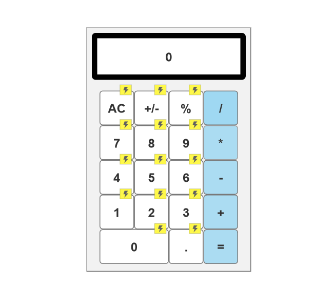
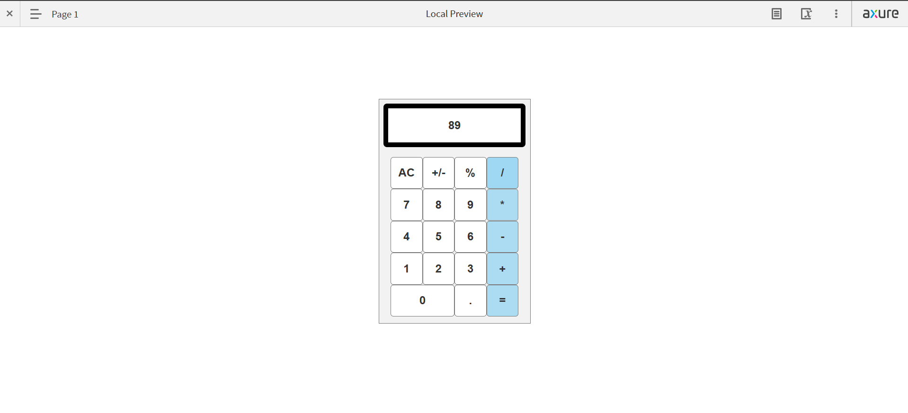

# Day02
# Axure RP Calculator Prototype

## Description
This is a calculator prototype built using **Axure RP**. It includes number buttons and basic functionalities.

## Features
- Clickable number buttons.
- Interactive UI for user input.

## How to Use
1. Open the **Axure RP** project file (`calculator.rp`).
2. Click **Preview** to launch the prototype.
3. Click the number buttons to enter values.

## Screenshots
 

##Preview
 
